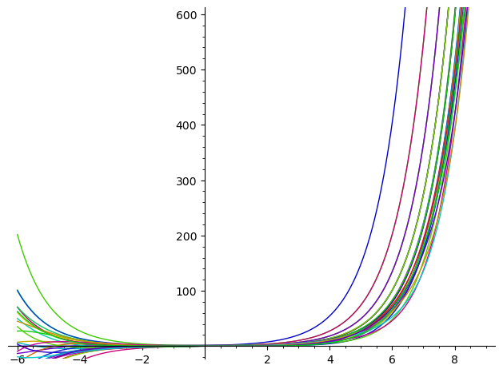

# Periodicity in Exponential Function Differences

Author: Joel B. Mohler

Date: 2022-11-28

## Abstract

The taylor series $\sum_{m=0}^{\infty} \frac{x^{a_m}}{{a_m}!}$ is convergent
for set of terms identified by ${a_m}$ an infinite increasing sequence of
positive integers.  These functions all behave similar to the exponential
function $e^x$.  In particular, if the sequence ${a_m}$ is an arithmetic
progression with common difference $d$ and first term $a_0<d$, then the
function $f(x)$ defined by this taylor series is it's own $d^{\textrm{th}}$
derivative.

## Self Derivative Series

Define the function $\mathcal{G}_{d}^{i}$ with $d\geq 1$ and $0\leq i<d$ to be
the $i-th$ offset Taylor series as 
$$
\mathcal{G}_{d}^{i}(x)=\sum_{n=0}^{\infty} \frac{x^{dn+i}}{(dn+i)!}.
$$

Observe the following familiar functions can be written in terms of these
building blocks:

$$
e^x=\mathcal{G}_1^0(x)
$$

$$
\mathrm{cosh}(x)=\mathcal{G}_2^0(x)\textrm{  and  } \mathrm{sinh}(x)=\mathcal{G}_2^1(x),
$$

$$
\mathrm{cos}(x)=\mathcal{G}_4^0(x)-\mathcal{G}_4^2(x)\textrm{  and  }
\mathrm{sin}(x)=\mathcal{G}_4^1(x)-\mathcal{G}_4^3(x).
$$

By computing the $d-\textrm{th}$ derivative of $f=\mathcal{G}_d^i$ directly on
the taylor series expansion we verify the claim of the abstract that
$f^{(d)}=f$.  So also we can verify the familiar claims of the above functions
being their own first, second and fourth derivatives respectively.

## Other functions

If you graph the families $\mathcal{G}_d^i$ with fixed $d$ and $0\leq i<d$ we
see that they cluster together by family of fixed $d$.  In fact, it is
startling looking that the graph of the $4$ functions $\mathcal{G}_4^i$
overlaid on the same graph appear to be equal for $x>>0$.  The startling fact
being that not only are these functions not equal but they criss cross each
other as we observe writing $\sin x$ and $\cos x$ as above.

{ width=250px }

For what follows, it is sufficient to graph the taylor series truncated at $40$
terms for $d>1$ and simply use $e^x$ for $d=1$.  Get a feel for this by
observing that $\frac{25^{80}}{{80}!}<1.0e-7$.  It is sufficient to graph the
interval $-3<x<25$ to walk through the following.

The expressions for $\sin x$ and $\cos x$ above suggest it is reasonable to
look at differences of the various $\mathcal{G}_{d}^{i}$.  The graph below is of
the 3 functions $\mathcal{G}_3^i-\mathcal{G}_3^j$ with $0\leq i<j<3$.  Observe
the exponential oscillation to the left and the exponential decay to the right.

{ width=250px }

Now, here are these same three functions scaled by multiplying by $e^{x/2}$.
Specifically
$$e^{x/2}\left(\mathcal{G}_3^i(x)-\mathcal{G}_3^j(x)\right)\textrm{.}$$

{ width=250px }

Observe in this scaled version that we can easily see the periodic zeros very
similar to $\sin$ and $\cos$.  Numerically the zeros are spaced with common
difference approximately $3.628$.

**Conjecture 1:**  There exists a periodic function $\mathcal{H}_3^{i,j}$ such that 
$$
\lim_{x\to \infty} e^{x/2}\left(\mathcal{G}_3^i(x)-\mathcal{G}_3^j(x)\right)-\mathcal{H}_3^{i,j}(x)=0\textrm{.}
$$
However they are not mutually derivitives of each other when the scaling factor
is included.

**Observation 2**: The difference $\mathcal{G}_2^0(x)-\mathcal{G}_2^1(x)$
converges to $0$ from above as $x\to\infty$.  There is no oscillation.  This is
easily verified by writing $\sinh$ and $\cosh$ as linear combinations of $e^x$
and $e^{-x}$ in the usual way.

**Observation 3**: The 6 differences $\mathcal{G}_4^i(x)-\mathcal{G}_4^j(x)$
need no scaling and are exactly periodic and mutually self-differential with a
small caveat.  Aside from the differences for $\sin$ and $\cos$, these
functions grow exponentially to the left.  The difference functions are
"visually periodic" for $x>5$.  As above in Conjecture 1 we can make this
precise with a periodic limiting function $\mathcal{H}_4^{i,j}$.

{ width=250px }

With correct scaling for each $d\geq 5$, we observe this same sort of periodic
behavior for $x>>0$.  The following table summarizes the numeric observation of
required scaling and resulting pariod lengths.

+----+----------+----------+--------------------------------------+
|  d |    scale |   period |                           amplitudes |
+====+==========+==========+======================================+
|  3 |    0.500 |    7.256 |                                1.155 |
+----+----------+----------+--------------------------------------+
|  4 |       -- |   $2\pi$ |                          0.707 1.000 |
+----+----------+----------+--------------------------------------+
|  5 |   -0.309 |    6.606 |                          0.470 0.761 |
+----+----------+----------+--------------------------------------+
|  6 |   -0.500 |    7.255 |                    0.334 0.578 0.667 |
+----+----------+----------+--------------------------------------+
|  7 |   -0.623 |    8.036 |                    0.248 0.447 0.557 |
+----+----------+----------+--------------------------------------+
|  8 |   -0.707 |    8.886 |              0.191 0.354 0.462 0.501 |
+----+----------+----------+--------------------------------------+
|  9 |   -0.766 |    9.775 |              0.152 0.286 0.385 0.438 |
+----+----------+----------+--------------------------------------+
| 10 |   -0.809 |   10.690 |        0.123 0.235 0.324 0.381 0.401 |
+----+----------+----------+--------------------------------------+
| 11 |   -0.841 |   11.622 |        0.102 0.196 0.274 0.330 0.360 |
+----+----------+----------+--------------------------------------+
| 12 |   -0.866 |   12.566 |  0.086 0.165 0.235 0.288 0.322 0.333 |
+----+----------+----------+--------------------------------------+
